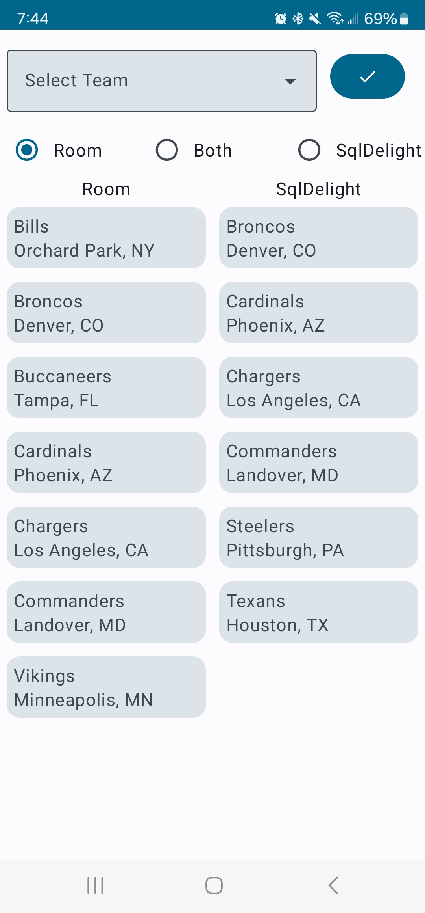
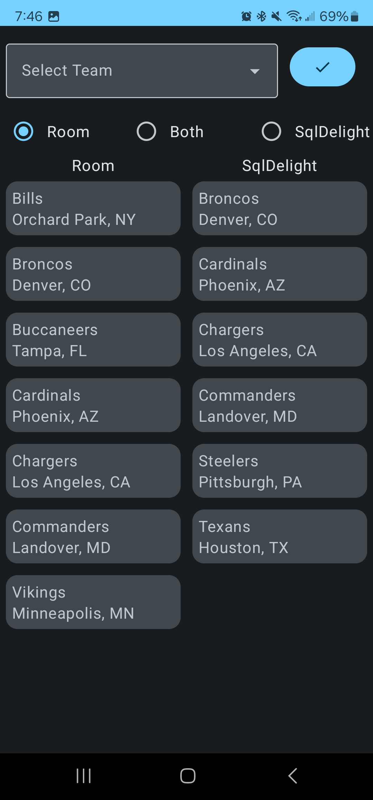

Android Kotlin project using clean architecture and makes use of two different local databases.

This project demonstrates using Room and SQLDelight databases. This project also uses Dagger Hilt to provide access to both local databases. 

# SQLDelight
SQLDelight generates typesafe kotlin APIs from your SQL statements.

For this project the **.sq** file used is located at app/src/main/sqldelight/com/ucfjoe/localdatabasesandroid/teams.sq

# Room
Room generates SQL based on a specified kotlin entity model.
The **entity** and **dao** used to generate the SQL are located at /app/src/main/java/com/ucfjoe/localdatabasesandroid/data/room

# Screenshots

| Screenshot Light Theme | Screenshot Dark Theme |
|------------------------|-----------------------|
 |||

